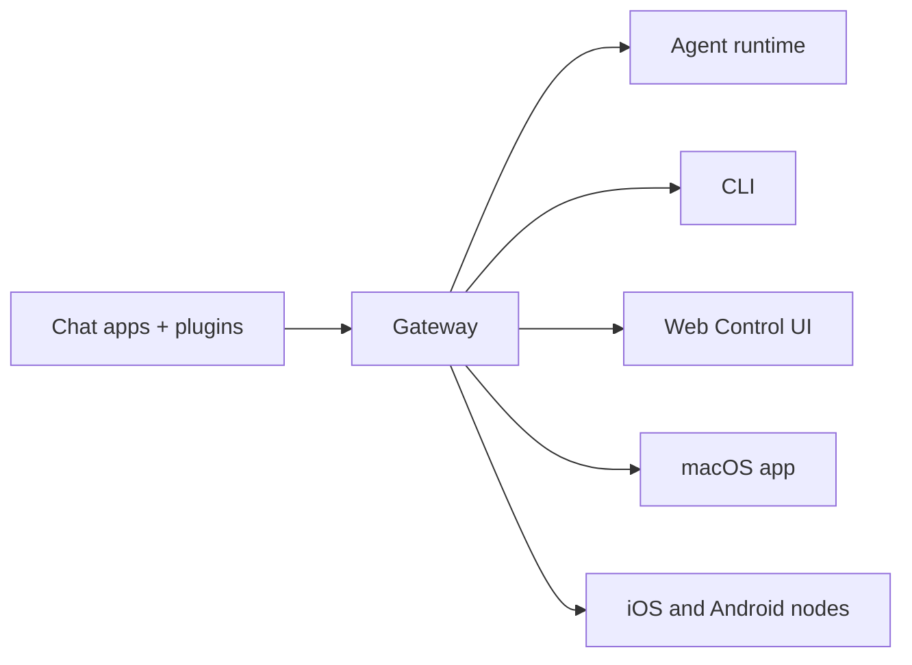

import { Card, CardGrid, Steps } from "@astrojs/starlight/components";

# RemoteClaw

<p align="center">
  
  
</p>

<p align="center">
  <strong>
    Any OS gateway for AI agents across 20+ channels — WhatsApp, Telegram, Discord, iMessage,
    Signal, Slack, Matrix, and more.
  </strong>
  <br />
  Send a message, get an agent response from your pocket.
</p>

<CardGrid>
  <Card title="Get Started">

[Get Started](/start/getting-started) —
Install RemoteClaw and bring up the Gateway in minutes.

  </Card>
  <Card title="Setup">

[Setup](/start/setup) —
Configure auth, gateway settings, and optional channels.

  </Card>
  <Card title="Open the Control UI">

[Open the Control UI](/web/control-ui) —
Launch the browser dashboard for chat, config, and sessions.

  </Card>
</CardGrid>

## What is RemoteClaw?

RemoteClaw is **AI agent middleware** that connects agent CLIs (Claude, Gemini, Codex, OpenCode) to messaging channels — WhatsApp, Telegram, Discord, iMessage, and more. You run a single Gateway process on your own machine (or a server), and it becomes the bridge between your messaging apps and your agent CLIs.

**Who is it for?** Developers and power users who want to run agent CLIs remotely via messaging channels — without giving up control of their data or relying on a hosted service.

**What makes it different?**

- **Self-hosted**: runs on your hardware, your rules
- **Multi-channel**: one Gateway serves WhatsApp, Telegram, Discord, and more simultaneously
- **Agent-native**: built for coding agents with tool use, sessions, memory, and multi-agent routing
- **Open source**: AGPL-3.0 licensed, community-driven

**What do you need?** Node 22+, an API key (Anthropic recommended), and 5 minutes.

## How it works



The Gateway is the single source of truth for sessions, routing, and channel connections.

## Key capabilities

<CardGrid>
  <Card title="Multi-channel gateway">
    WhatsApp, Telegram, Discord, and iMessage with a single Gateway process.
  </Card>
  <Card title="Plugin channels">Add Mattermost and more with extension packages.</Card>
  <Card title="Multi-agent routing">Isolated sessions per agent, workspace, or sender.</Card>
  <Card title="Media support">Send and receive images, audio, and documents.</Card>
  <Card title="Web Control UI">Browser dashboard for chat, config, sessions, and nodes.</Card>
  <Card title="Mobile nodes">Pair iOS and Android nodes with Canvas support.</Card>
</CardGrid>

## Quick start

<Steps>

1. **Install RemoteClaw**

   ```bash
   npm install -g remoteclaw@latest
   ```

2. **Onboard and install the service**

   ```bash
   remoteclaw onboard --install-daemon
   ```

3. **Pair WhatsApp and start the Gateway**

   ```bash
   remoteclaw channels login
   remoteclaw gateway --port 18789
   ```

</Steps>

Need the full install and dev setup? See [Quick start](/start/quickstart).

## Dashboard

Open the browser Control UI after the Gateway starts.

- Local default: [http://127.0.0.1:18789/](http://127.0.0.1:18789/)
- Remote access: [Web surfaces](/web) and [Tailscale](/gateway/tailscale)

## Configuration (optional)

Config lives at `~/.remoteclaw/remoteclaw.json`.

- If you **do nothing**, RemoteClaw uses the default CLI agent runtime with per-sender sessions.
- If you want to lock it down, start with `channels.whatsapp.allowFrom` and (for groups) mention rules.

Example:

```json5
{
  channels: {
    whatsapp: {
      allowFrom: ["+15555550123"],
      groups: { "*": { requireMention: true } },
    },
  },
  messages: { groupChat: { mentionPatterns: ["@remoteclaw"] } },
}
```

## Start here

<CardGrid>
  <Card title="Docs hubs">

[Docs hubs](/start/hubs) —
All docs and guides, organized by use case.

  </Card>
  <Card title="Configuration">

[Configuration](/gateway/configuration) —
Core Gateway settings, tokens, and provider config.

  </Card>
  <Card title="Remote access">

[Remote access](/gateway/remote) —
SSH and tailnet access patterns.

  </Card>
  <Card title="Channels">

[Channels](/channels/telegram) —
Channel-specific setup for WhatsApp, Telegram, Discord, and more.

  </Card>
  <Card title="Nodes">

[Nodes](/nodes) —
iOS and Android nodes with pairing and Canvas.

  </Card>
  <Card title="Help">

[Help](/help) —
Common fixes and troubleshooting entry point.

  </Card>
</CardGrid>

## Learn more

<CardGrid>
  <Card title="Full feature list">

[Full feature list](/concepts/features) —
Complete channel, routing, and media capabilities.

  </Card>
  <Card title="Multi-agent routing">

[Multi-agent routing](/concepts/multi-agent) —
Workspace isolation and per-agent sessions.

  </Card>
  <Card title="Security">

[Security](/gateway/security) —
Tokens, allowlists, and safety controls.

  </Card>
  <Card title="Troubleshooting">

[Troubleshooting](/gateway/troubleshooting) —
Gateway diagnostics and common errors.

  </Card>
  <Card title="About and credits">

[About and credits](/reference/credits) —
Project origins, contributors, and license.

  </Card>
</CardGrid>
