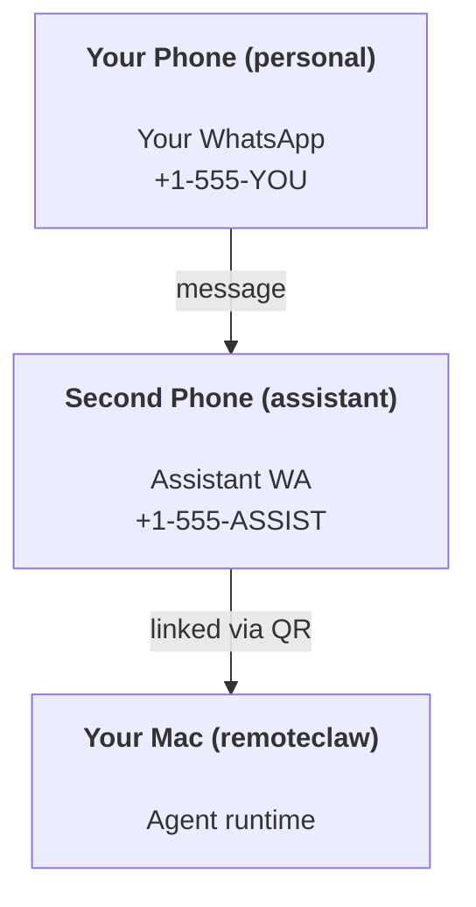

# Building a personal assistant with RemoteClaw

RemoteClaw is a gateway for **CLI agents** (Claude, Gemini, Codex, OpenCode) with 20+ channel integrations — WhatsApp, Telegram, Discord, iMessage, Signal, Slack, Matrix, Microsoft Teams, Google Chat, LINE, and more. This guide is the "personal assistant" setup: one dedicated WhatsApp number that behaves like your always-on agent.

## ⚠️ Safety first

You’re putting an agent in a position to:

- run commands on your machine (depending on the agent's configured tools/MCP servers)
- read/write files in your workspace
- send messages back out via any connected channel (WhatsApp, Telegram, Slack, etc.)

Start conservative:

- Always set `channels.whatsapp.allowFrom` (never run open-to-the-world on your personal Mac).
- Use a dedicated WhatsApp number for the assistant.
- Heartbeats now default to every 30 minutes. Disable until you trust the setup by setting `agents.defaults.heartbeat.every: "0m"`.

## Prerequisites

- RemoteClaw installed and onboarded — see [Getting Started](/start/getting-started) if you haven't done this yet
- A second phone number (SIM/eSIM/prepaid) for the assistant

## The two-phone setup (recommended)

You want this:



If you link your personal WhatsApp to RemoteClaw, every message to you becomes “agent input”. That’s rarely what you want.

## 5-minute quick start

1. Pair WhatsApp Web (shows QR; scan with the assistant phone):

```bash
remoteclaw channels login
```

2. Start the Gateway (leave it running):

```bash
remoteclaw gateway --port 18789
```

3. Put a minimal config in `~/.remoteclaw/remoteclaw.json`:

```json5
{
  channels: { whatsapp: { allowFrom: ["+15555550123"] } },
}
```

Now message the assistant number from your allowlisted phone.

When onboarding finishes, we auto-open the dashboard and print a clean (non-tokenized) link. If it prompts for auth, paste the token from `gateway.auth.token` into Control UI settings. To reopen later: `remoteclaw dashboard`.

## Give the agent a workspace

The workspace is the agent’s working directory. Agents bring their own
configuration (e.g. `CLAUDE.md` for Claude Code, `.gemini/` for Gemini CLI).
RemoteClaw does not seed or manage template files in the workspace.

There is no built-in workspace path — you must configure one explicitly via
`agents.defaults.workspace` or per-agent `agents.list[].workspace`.

```bash
remoteclaw setup
```

Tip: treat this folder like the agent’s “memory” and make it a private git repo
so memory files are backed up.

Full workspace layout + backup guide: [Agent workspace](/concepts/agent-workspace)

Optional: choose a different workspace with `agents.defaults.workspace` (supports `~`).

```json5
{
  agent: {
    workspace: "~/.remoteclaw/workspace",
  },
}
```

## The config that turns it into “an assistant”

RemoteClaw defaults to a good assistant setup, but you’ll usually want to tune:

- persona/instructions via native agent config (e.g. `CLAUDE.md`)
- thinking defaults (if desired)
- heartbeats (once you trust it)

Example:

```json5
{
  logging: { level: "info" },
  agent: {
    workspace: "~/.remoteclaw/workspace",
    timeoutSeconds: 1800,
    // Start with 0; enable later.
    heartbeat: { every: "0m" },
  },
  channels: {
    whatsapp: {
      allowFrom: ["+15555550123"],
      groups: {
        "*": { requireMention: true },
      },
    },
  },
  routing: {
    groupChat: {
      mentionPatterns: ["@remoteclaw", "remoteclaw"],
    },
  },
  session: {
    scope: "per-sender",
    resetTriggers: ["/new", "/reset"],
    reset: {
      mode: "daily",
      atHour: 4,
      idleMinutes: 10080,
    },
  },
}
```

## Sessions and memory

- Session files: `~/.remoteclaw/agents/<agentId>/sessions/{{SessionId}}.jsonl`
- Session metadata (token usage, last route, etc): `~/.remoteclaw/agents/<agentId>/sessions/sessions.json` (legacy: `~/.remoteclaw/sessions/sessions.json`)
- `/new` or `/reset` starts a fresh session for that chat (configurable via `resetTriggers`). If sent alone, the agent replies with a short hello to confirm the reset.
- `/compact [instructions]` compacts the session context and reports the remaining context budget.

## Heartbeats (proactive mode)

By default, RemoteClaw runs a heartbeat every 30 minutes with the prompt:
`Read HEARTBEAT.md if it exists (workspace context). Follow it strictly. Do not infer or repeat old tasks from prior chats. If nothing needs attention, reply HEARTBEAT_OK.`
Set `agents.defaults.heartbeat.every: "0m"` to disable.

- If `HEARTBEAT.md` exists but is effectively empty (only blank lines and markdown headers like `# Heading`), RemoteClaw skips the heartbeat run to save API calls.
- If the file is missing, the heartbeat still runs and the model decides what to do.
- If the agent replies with `HEARTBEAT_OK`, RemoteClaw suppresses outbound delivery for that heartbeat.
- Heartbeat delivery to DM-style `user:<id>` targets is blocked; those runs still execute but skip outbound delivery.
- Heartbeats run full agent turns — shorter intervals burn more tokens.

```json5
{
  agent: {
    heartbeat: { every: "30m" },
  },
}
```

## Media in and out

Inbound attachments (images/audio/docs) can be surfaced to your command via templates:

- `{{MediaPath}}` (local temp file path)
- `{{MediaUrl}}` (pseudo-URL)
- `{{Transcript}}` (if audio transcription is enabled)

Outbound attachments from the agent: include `MEDIA:<path-or-url>` on its own line (no spaces). Example:

```
Here’s the screenshot.
MEDIA:https://example.com/screenshot.png
```

RemoteClaw extracts these and sends them as media alongside the text.

## Operations checklist

```bash
remoteclaw status          # local status (creds, sessions, queued events)
remoteclaw status --all    # full diagnosis (read-only, pasteable)
remoteclaw status --deep   # adds gateway health probes (Telegram + Discord)
remoteclaw health --json   # gateway health snapshot (WS)
```

Logs live under `/tmp/remoteclaw/` (default: `remoteclaw-YYYY-MM-DD.log`).

## Next steps

- WebChat: [WebChat](/web/webchat)
- Gateway ops: [Gateway runbook](/gateway)
- Cron + wakeups: [Cron jobs](/automation/cron-jobs)
- macOS menu bar companion: [RemoteClaw macOS app](/platforms/macos)
- iOS node app: [iOS app](/platforms/ios)
- Android node app: [Android app](/platforms/android)
- Windows status: [Windows (WSL2)](/platforms/windows)
- Linux status: [Linux app](/platforms/linux)
- Security: [Security](/gateway/security)
